# Team members:
- Rawabe Ebrahim
- Khalid Alruwidhan
- Faisal Alqahtani

# Introduction (problem, objectives)
Our dataset is talking about a famous Super store that have three main categories witch are: Office Supplies, Technology and Furniture. The store have an external orders from different sectors, so..

## The problem is: they want to see the business is successful or not and they want to add an expansion plan to increase sales.

## The objectives:
- What are the best selling products?
- What are the most cities demand?
- What is the most customer segment demand?
- What is the most Preferred Ship Mode?
- Describe the total sales and orders according to category and month.
- What are the products that have a high shipping cost?
- Define number of product category according to the region
- What is the profit from sales?

# Dataset Source:
- kaggle

# Describe the final ten insights:
- What are the best selling products?
- The best selling products.. top 10

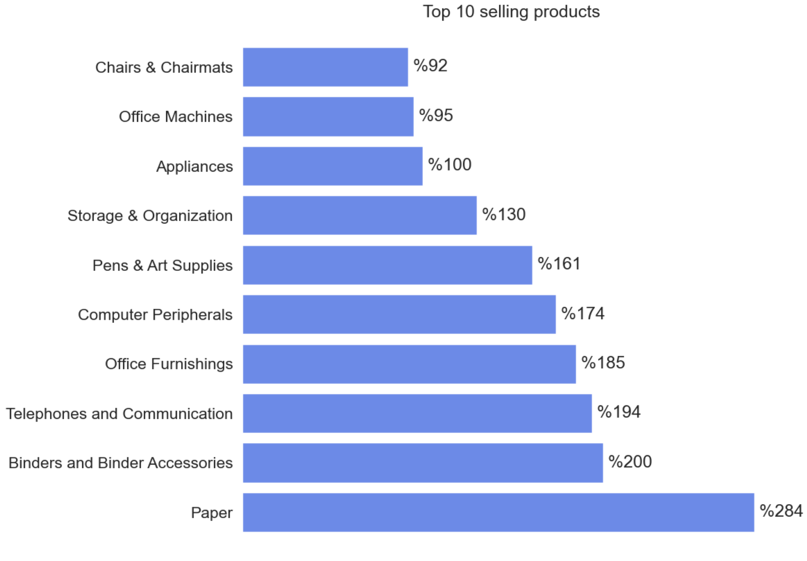

- What are the most cities demand?
- The most cities demand 

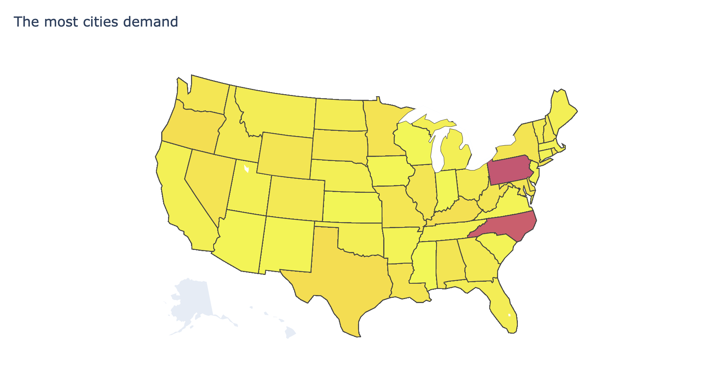

- What is the most customer segment demand?
- The most Customer Segment demand

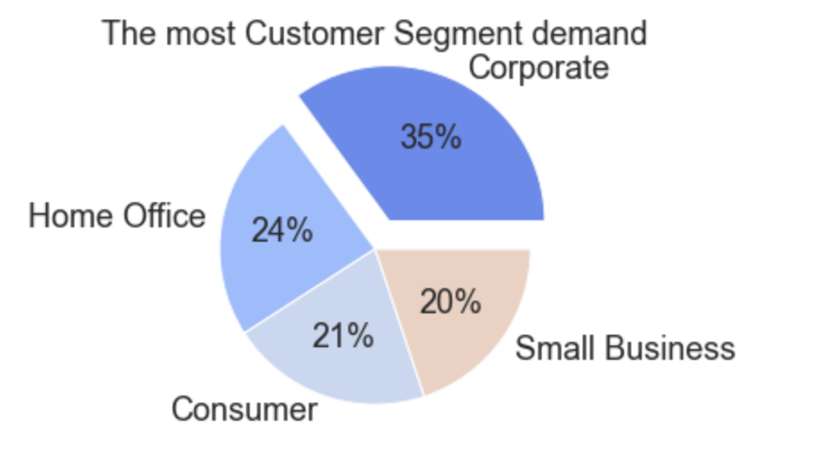

- What is the most Preferred Ship Mode?
- Preferred Ship Mode

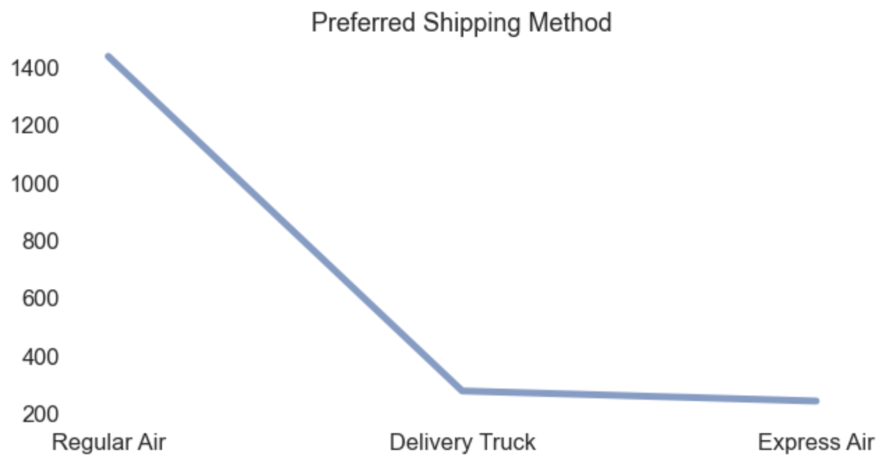

- Total sales based on category and Sub-Category

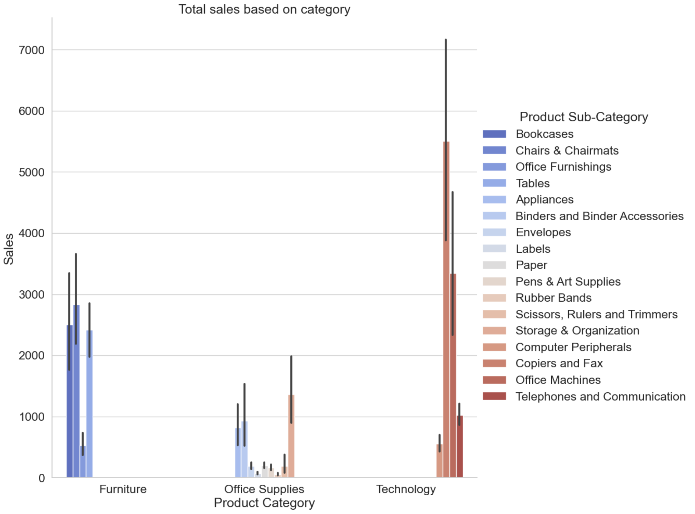

- Total sales based on month and Region

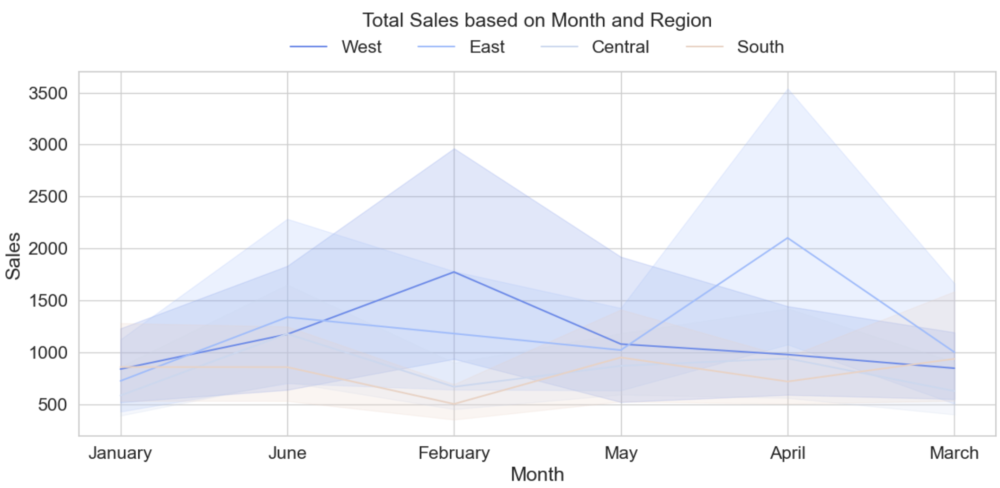

- Total orders based on month

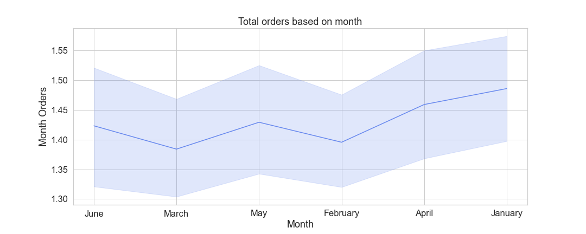

- What are the products that have a high shipping cost?
- The products that have a high shipping cost

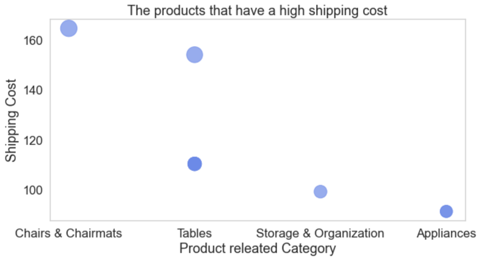

- Define number of product category according to the region
- Number of product category according to the region

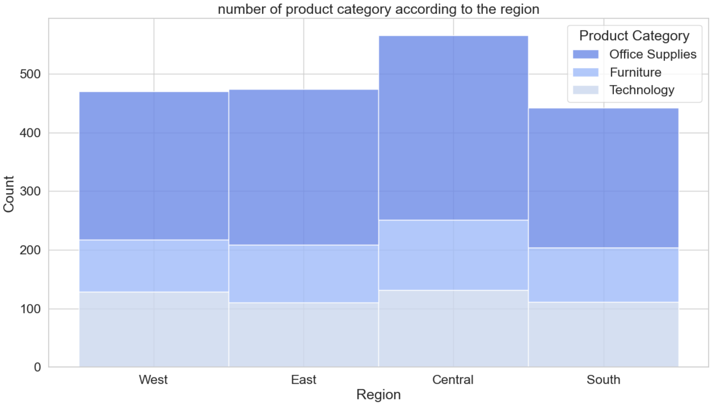

- What is the profit from sales?
- Total Profit and Sales per Sub-Category

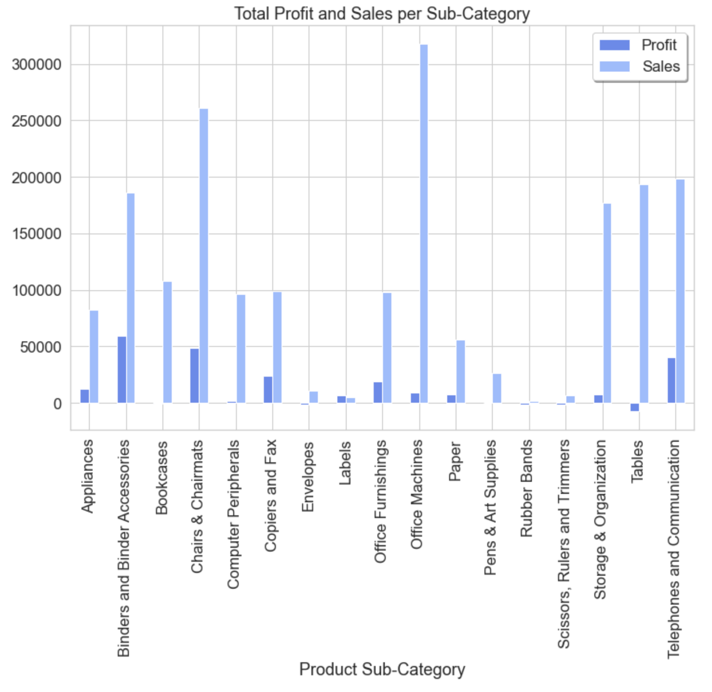

- Total state dealing

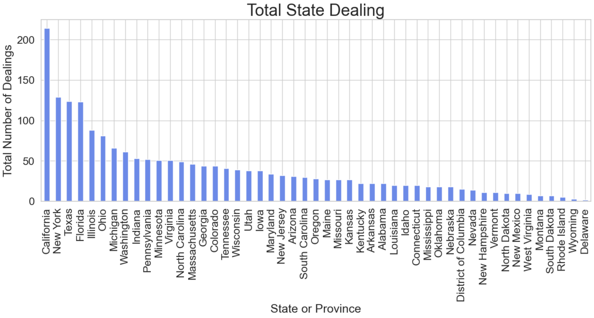

- Describes of discount

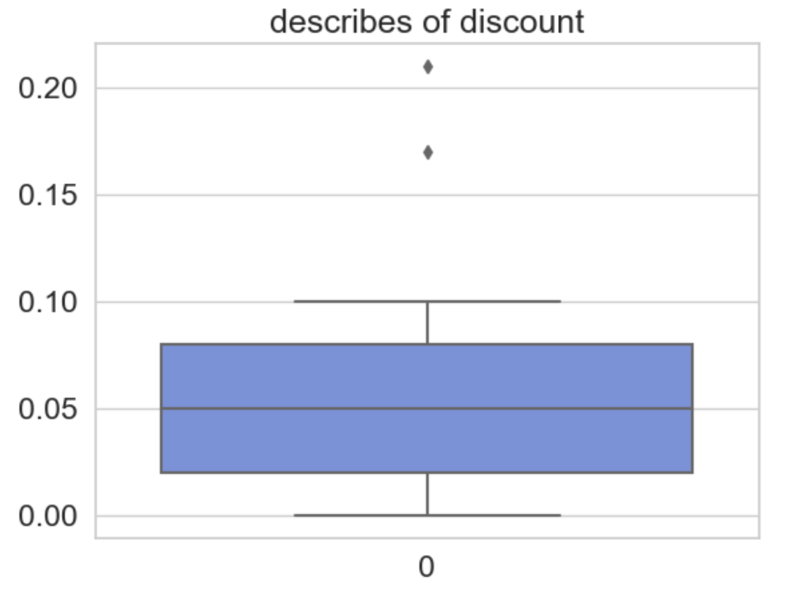
